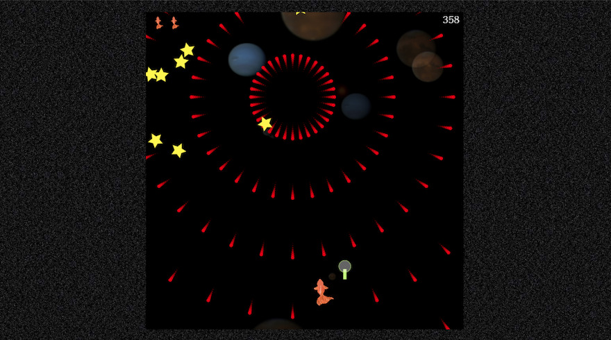

# 金魚救い

〜ポイを投擲(ポイ)して金魚をすくえ〜  
お前に金魚が救えるか？Planet Of Intelligence の力を信じろ！

### [→Go to GamePage!](https://mloa.github.io/kingyo-sukui/)

## ゲーム概要

時は西暦 3XXX 年，人類滅亡後の世界では飛行能力を得た水生生物が宇宙へ進出していた．  
まさに今ここに新天地へ旅立たんとする１匹のコメット([※金魚の品種](<https://ja.wikipedia.org/wiki/%E3%82%B3%E3%83%A1%E3%83%83%E3%83%88_(%E3%82%AD%E3%83%B3%E3%82%AE%E3%83%A7)>))がいる．  
神の視点となった君には，伝説のアーティファクト： Planet Of Intelligence 通称 POI を駆使して彼の安全な旅路を確保してほしい．

彼はこの宇宙時代の彗星となれるのか！？さぁ君も Let's POI！(プレイ後はぜひ Tweet してね)

スマホでも遊べます．  

## 制作背景

[第 3 回 ツクってアソぶハッカソン](https://tsukuaso.connpass.com/event/249420/)のテーマ: 『「いや違う。そうじゃない。」とツッコまれたくなるモノまたはサービスをツクる。』に合わせて，金魚を「すくう」ゲームを制作しました．いくつか夏に関連するテーマも出ていましたが，インパクトやゲームとして見栄えがありそうなこの案になりました．

## 開発について

48 時間という短い時間でアイデア出し〜公開まで必要なため，手元で server を建てる環境として vite を，github pages で公開するフローを採用し，開発パフォーマンスを上げました．チームとして STG 制作は初めてでしたが，19 日の夜(開始後 24H)には概ね遊べるところまで完成させられていたので，デザインやロゴにも力を入れることができました．

### 利用言語・フレームワーク

- javascript
- node.js
- p5.js

## 謝辞

弾幕を作るに際し，[p5.js で始める 弾幕プログラミング入門](https://qiita.com/WGG_SH/items/e4c12fb6ff62d2502fbd)のコードを参考にさせていただきました．ありがとうございました．

## 関連リンク

- [connpass](https://tsukuaso.connpass.com/event/249420/)
- [ツクってアソぶハッカソン](https://tsukuaso.com/)
